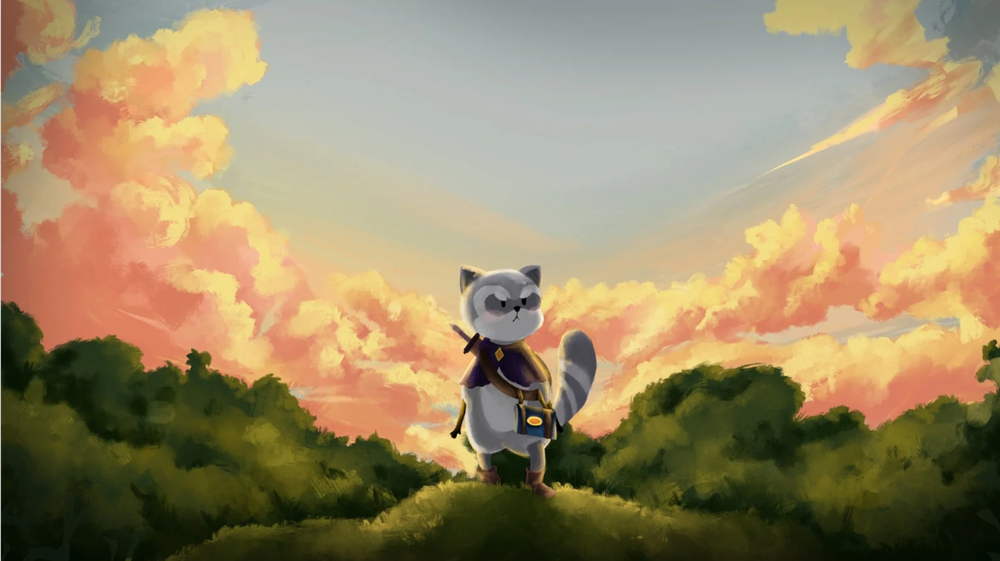

# Puddle's Legacy

Puddle’s Legacy is a single-player real-time action role-playing game (RPG) set in a fantasy world. Sabrina must follow the footsteps of her missing father to fill a magical book of beasts by exploring very dangerous terrain. Will Sabrina manage to find her father in this adventure?




## Our Project

- Explore
- Fight
- Recolect
- Craft potions
- Meet the villagers

## Authors

### Development

- Hugo Castaño Cuéllar ([@LazyRacoonDev](https://github.com/LazyRacoonDev))
- Mario Dorado Martínez ([@mdoradom](https://www.github.com/mdoradom))
- Rebeca Fernández López ([@Becca203](https://github.com/Becca203))
- Marta Jover Valero ([@martagnarta](https://www.github.com/martagnarta))
- Alexia Palacín Bargalló ([@apb8](https://www.github.com/apb8))
- María Perarnau Sangüesa ([@MariaPerarnau](https://github.com/MariaPerarnau))
- Dídac Pérez Marquez ([@didacpema](https://github.com/didacpema))
- Hugo Planell Moreno ([@HugoPlacer](https://github.com/HugoPlacer))
- Carla Puga Pérez ([@cpugaper](https://github.com/cpugaper))
- Nicolás Sort Sauquillo ([@nsortsauquillo](https://www.github.com/nsortsauquillo))

### Artist

- Daria Tuvasheva
- Teresa Llisó
- Laia Guinart
- Camila Pineda
- Ivet Clofen
- Patricia Aragón
- Claudia Polo
- Carla Yu

## Puddle's Legacy Trailer

Insertar vídeo cuando se tenga.

## Controls

```
    W, A, S, D to move
    Right click to cover with a shield
    Left click to attack
    F1 Debug menu
    F4 Move the camera
    1 and 2 to change weapons sword and staff
```
